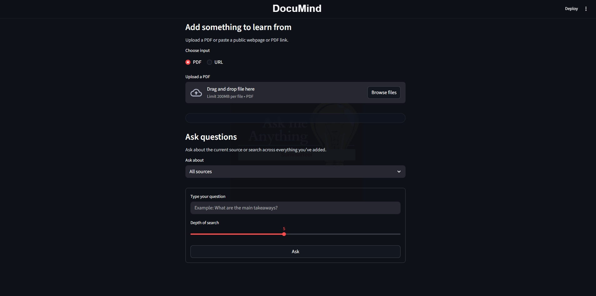

# DocuMind (RAG-based Document & Web Q&A)

DocuMind is an AI-powered document and web assistant that lets users learn from **PDFs** and **public webpages**, index them in a vector database, and ask follow-up questions in plain English. The app uses a Streamlit frontend, a FastAPI backend, Inngest-powered background workflows, and Qdrant for semantic retrieval.

---

## 🚀 Features

- **Multi-source ingestion**
  - Upload PDF documents
  - Paste public webpage URLs
  - Paste direct PDF URLs
  - Extracts and chunks content for downstream retrieval

- **Semantic retrieval**
  - Generates embeddings for each chunk
  - Stores vectors and metadata in **Qdrant**
  - Searches by meaning, not just keyword matching

- **Grounded Q&A**
  - Embeds the user’s question
  - Retrieves the most relevant chunks from Qdrant
  - Generates answers grounded in retrieved context
  - Supports follow-up questions over the same source

- **Multi-turn interaction**
  - Keeps conversation history for the selected source
  - Allows users to ask repeated questions without starting over

- **Workflow-friendly backend**
  - Ingestion and query flows are handled through **Inngest**
  - Improves observability, reliability, and debugging of background steps

---

## 🖥️ App Interface



---

## 🧱 Tech Stack

- **Streamlit** — frontend UI
- **FastAPI** — backend application
- **Inngest** — event-driven workflow orchestration
- **Qdrant** — vector database (local Docker container)
- **OpenAI API** — embeddings and LLM responses
- **LlamaIndex** — PDF loading and chunking
- **Trafilatura / Requests** — webpage content extraction

---

## 📁 Project Structure

```text
PDF-Summarizer/
  app/
    main.py              # FastAPI app + Inngest-powered ingestion/query workflows
    data_loader.py       # PDF/URL loader, chunker, embeddings
    vector_db.py         # Qdrant storage (upsert + semantic search)
    custom_types.py      # Pydantic models for workflow step I/O
    streamlit_app.py     # Streamlit frontend
    logo.png             # App logo (optional)
  uploads/               # Temporary uploaded PDFs
  .env                   # Local environment variables (not committed)
  requirements.txt
