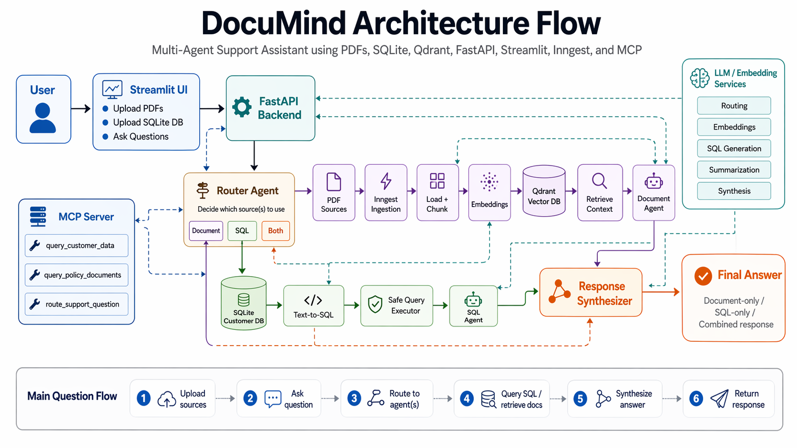

# DocuMind: Generative AI Multi-Agent Support Assistant

<p align="center">
  
</p>

<h1 align="center">DocuMind: Generative AI Multi-Agent Support Assistant</h1>

<p align="center">
  Query structured customer data and unstructured policy documents through a single multi-agent support assistant.
</p>

DocuMind is a Generative AI-powered multi-agent system built for customer-support style workflows.

It helps a support executive interact with both:
- **structured customer data** stored in a SQL database
- **unstructured company documents** such as policy PDFs stored in a vector database

The system supports natural language questions and routes them to the right component:
- a **document agent** for policy and PDF questions
- a **SQL agent** for customer and support-ticket questions
- a **router** that decides whether the answer should come from one agent or both

This project was built to satisfy the assessment requirement of creating a **Generative AI Multi-Agent System** that can query structured data, process unstructured documents, and provide context-aware responses.

---
## Architecture 

<p align="center">
  
</p>

<h1 align="center">DocuMind: Generative AI Multi-Agent Support Assistant</h1>

<p align="center">

## What this project does


### 1. Document understanding
Users can upload one or more PDF policy documents.

The system:
- reads and chunks the documents
- embeds the chunks
- stores them in Qdrant
- retrieves relevant context for user questions
- answers using retrieved context only

Example:
> “What is the current refund policy?”

---

### 2. Structured customer-data querying
The system also works with structured customer-support data stored in SQLite.

It supports natural-language questions such as:
> “Give me a quick overview of customer Ema Carter’s profile and past support ticket details.”

The SQL agent:
- converts the question into a safe SQL query
- executes read-only SQL
- summarizes the results into a user-friendly answer

---

### 3. Multi-agent routing
A router determines whether a question should be handled by:
- the document agent
- the SQL agent
- or both

Example:
> “Based on the refund policy and Ema Carter’s recent tickets, is she likely eligible for a refund?”

In that case, the system:
- retrieves the relevant policy context from the vector database
- retrieves the customer and ticket details from SQLite
- synthesizes both into one final response

---

### 4. MCP server support
The project also includes an MCP server that exposes the system’s capabilities as tools:
- query structured customer data
- query policy documents
- route a combined support question

This makes the system easier to integrate with MCP-compatible clients and clearly addresses the MCP requirement in the assignment.

---

## Architecture overview

The system is organized into the following components.

### Frontend
- **Streamlit**
- Upload PDFs
- Upload SQLite DB
- Ask questions through a single interface

### Backend
- **FastAPI**
- Handles SQL and routed chat endpoints
- Shares logic with the document and SQL agents

### Document pipeline
- PDF loading and chunking
- Embeddings
- Qdrant vector storage
- Retrieval-based answer generation

### Structured data pipeline
- SQLite database
- Text-to-SQL generation
- Safe query execution
- Customer/ticket summarization

### Routing and synthesis
- Router agent determines which path to use
- Response synthesizer merges SQL and document outputs when both are needed

### MCP layer
- MCP server exposes the same capabilities as tools

---

## Tech stack

- **Frontend:** Streamlit
- **Backend:** FastAPI
- **Workflow/Event handling:** Inngest
- **Structured DB:** SQLite
- **Vector DB:** Qdrant
- **LLM + embeddings:** OpenAI API
- **MCP:** MCP Python SDK
- **Language:** Python

---

## Project structure

```text
app/
├── main.py
├── streamlit_app.py
├── custom_types.py
├── data_loader.py
├── vector_db.py
│
├── agents/
│   ├── router_agent.py
│   ├── sql_agent.py
│   └── response_synthesizer.py
│
├── sql/
│   ├── schema.sql
│   ├── db.py
│   ├── seed_data.py
│   ├── query_executor.py
│   ├── text_to_sql.py
│   └── customer_summary.py
│
├── mcp/
│   ├── __init__.py
│   └── server.py
│
└── utils/
    └── prompts.py
```

## Usage

Once the services are running, open the Streamlit app in your browser and use it as the main interface.

### 1. Add document sources
Upload one or more PDF files containing policy or support documents.

Examples:
- refund policy
- cancellation policy
- support guidelines

After upload, click the document indexing button so the files are processed, chunked, embedded, and stored in Qdrant.

### 2. Add structured customer data
Upload the SQLite database file, or use the seeded local database if already available.

The structured database is used for:
- customer profile lookups
- support ticket history
- account status and plan queries
- billing or refund-related customer records

### 3. Ask questions
Use the question box in the Streamlit UI to ask natural language questions.

The backend router will decide whether the question should be answered using:
- the **document agent**
- the **SQL agent**
- or **both**

### 4. Supported query types

#### Document-only queries
Use these when you want information from uploaded PDFs.

Examples:
- What is the current refund policy?
- Does cancellation automatically guarantee a refund?
- What happens to customer data after cancellation?

#### SQL-only queries
Use these when you want information from structured customer/support data.

Examples:
- Give me a quick overview of customer Ema Carter’s profile and past support ticket details.
- Which customers have open tickets?
- What is Liam Scott’s current account status?

#### Combined queries
Use these when the answer depends on both policy documents and customer history.

Examples:
- Based on the refund policy and Ema Carter’s recent tickets, is she likely eligible for a refund?
- Using the support guidelines and Ema Carter’s ticket history, how should support prioritize her case?

### 5. Response behavior
Depending on the query, the system returns:
- a document-grounded answer from retrieved PDF context
- a structured summary based on SQL query results
- or a synthesized answer combining both sources

### 6. API usage

#### Query structured customer data
`POST /query-sql`

Example request body:

```json
{
  "question": "Give me a quick overview of customer Ema Carter's profile and past support ticket details."
}
